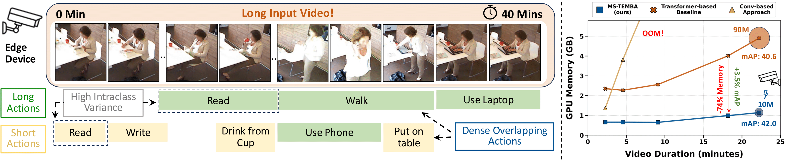

<h1>MS-Temba: Multi-Scale Temporal Mamba for Efficient Temporal Action Detection</h1>

## Abstract
Action detection in real-world scenarios is particularly challenging due to densely distributed actions in hour-long untrimmed videos. It requires modeling both short- and long-term temporal relationships while handling significant intra-class temporal variations. Previous state-of-the-art (SOTA) Transformer-based architectures, though effective, are impractical for real-world deployment due to their high parameter count, GPU memory usage, and limited throughput, making them unsuitable for very long videos. 
In this work, we innovatively adapt the Mamba architecture for action detection and propose <b>Multi-scale Temporal Mamba (MS-Temba)</b>, comprising two key components: Temporal Mamba (Temba) Blocks and the Temporal Mamba Fuser. Temba Blocks include the Temporal Local Module (TLM) for short-range temporal modeling and the Dilated Temporal SSM (DTS) for long-range dependencies. By introducing dilations, a novel concept for Mamba, TLM and DTS capture local and global features at multiple scales. The Temba Fuser aggregates these scale-specific features using Mamba to learn a comprehensive multi-scale representation of untrimmed videos.
MS-Temba is validated on three public datasets, outperforming SOTA methods for long-duration videos and matching prior methods on short videos while using only one-eighth of the parameters.

## Envs. for Pretraining

- Python 3.10.13

  - `conda create -n your_env_name python=3.10.13`

- torch 2.1.1 + cu118
  - `pip install torch==2.1.1 torchvision==0.16.1 torchaudio==2.1.1 --index-url https://download.pytorch.org/whl/cu118`

- Requirements: vim_requirements.txt
  - `pip install -r vim/vim_requirements.txt`

- Install ``causal_conv1d`` and ``mamba``
  - `pip install -e causal_conv1d>=1.1.0`
  - `pip install -e mamba-1p1p1`
  

## Train Your Vim

`bash vim/scripts/pt-vim-t.sh`

## Train Your Vim at Finer Granularity
`bash vim/scripts/ft-vim-t.sh`

## Acknowledgement 
This project is based on Mamba ([paper](https://arxiv.org/abs/2312.00752), [code](https://github.com/state-spaces/mamba)), Vision-Mamba ([paper](), [code](https://github.com/hustvl/Vim)), MS-TCT ([paper](https://openaccess.thecvf.com/content/CVPR2022/papers/Dai_MS-TCT_Multi-Scale_Temporal_ConvTransformer_for_Action_Detection_CVPR_2022_paper.pdf), [code](https://github.com/dairui01/MS-TCT)). Thanks for their wonderful works.

